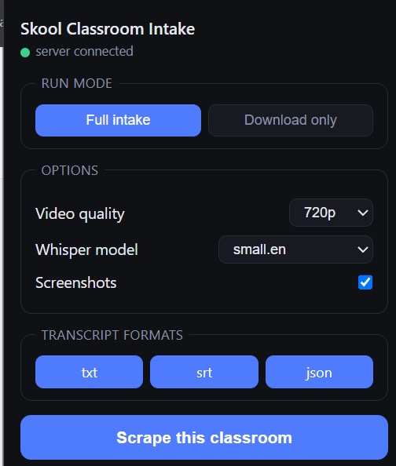
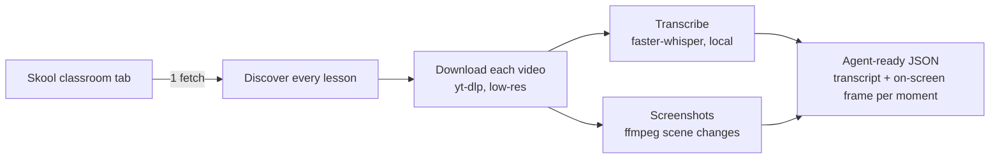

# skoolVidScraper

**Turn any Skool classroom into agent-readable knowledge.** One click ingests an
entire course: every lesson video is downloaded, transcribed locally, and
screenshotted at each on-screen change, then fused into a single JSON where each
line of transcript carries the exact frame that was on screen when it was said.

Think **NotebookLM-style ingestion, but for Skool courses** and pointed at your AI
agents, RAG pipelines, or note systems.

> [!IMPORTANT]
> **For personal use only.** Use skoolVidScraper only on classrooms you are a
> legitimate, paid-up member of, and only for your own study, note-taking, and
> private AI knowledge bases. **Do not redistribute, re-host, resell, or publicly
> share** downloaded videos, transcripts, or screenshots, and do not use this tool
> for piracy or any other unlawful purpose. Course content belongs to its
> creators. You alone are responsible for complying with Skool's Terms of Service,
> copyright law, and each creator's rights.


<p align="center">
  
  <br>
  <em>One click from the classroom tab: pick your settings and scrape.</em>
</p>

---

## Why

Skool hosts a huge amount of high-signal course content, but it is locked inside a
video player. If you want an AI agent to actually *use* a course, you need both
**what was said** and **what was on screen** (slides, dashboards, code, diagrams),
aligned in time. skoolVidScraper produces exactly that, entirely on your machine:

- **No API keys, no cloud.** Transcription runs locally via Whisper.
- **No passwords, no browser automation.** It authenticates with your own live
  browser session.
- **One click.** A bundled Chrome extension launches the whole pipeline from the
  classroom tab you are already looking at.

## How it works



One authenticated fetch enumerates the full lesson tree. Videos on Wistia,
YouTube, Loom, and **Mux signed-HLS** are all handled. Screenshots use a hybrid
strategy: a frame at every visual change plus a guaranteed frame every N seconds,
so nothing is missed even on talking-head lessons.

## Features

- One-click **Chrome extension** launcher (reads the active URL + your live Skool cookies)
- **Local, offline transcription** with [faster-whisper](https://github.com/SYSTRAN/faster-whisper) (auto-detects an NVIDIA GPU, falls back to CPU)
- **Scene-change + interval screenshots** via ffmpeg, named by timestamp
- **Consolidated JSON** aligning each transcript segment to the on-screen frame
- Handles **Mux signed-HLS**, Wistia, YouTube, Loom, and more (via yt-dlp)
- **Per-classroom output folders**, tidy and collision-free
- Runs as a **system-tray app**, a **CLI**, or a **local server**

## Quickstart

**Requirements:** Python 3.10+, [ffmpeg](https://ffmpeg.org/) on your PATH
(`winget install Gyan.FFmpeg` on Windows). An NVIDIA GPU is optional (CPU works).

```bash
git clone https://github.com/grandheman/skoolVidScraper
cd skoolVidScraper

# install the CLI (add [tray] for the system-tray app, [gpu] for NVIDIA acceleration)
pip install ".[tray,gpu]"
```

### The one-click way (recommended)

1. Start the helper as a tray app (or `skoolvidscraper serve` for a console):
   ```bash
   skoolvidscraper tray
   ```
2. Load the extension: open `chrome://extensions`, enable **Developer mode**, click
   **Load unpacked**, and select the `extension/` folder.
3. Open a Skool classroom tab, click the extension icon, choose your settings, and
   hit **Scrape this classroom**. Progress shows right in the popup.

That is it. No cookie exports, no config files. The extension reads your live
Skool session (including the HttpOnly auth cookies) and hands the job to the local
helper.

### The command-line way

```bash
cp config.example.json config.json     # set "classroom_url" (and provide cookies)
skoolvidscraper scrape --transcribe     # download + transcribe + screenshots
```

Re-run intake on an already-downloaded folder anytime:

```bash
skoolvidscraper transcribe --model medium.en
skoolvidscraper transcribe --formats json --no-screenshots
```

## Output

For each lesson, next to the downloaded video:

```
downloads/<community>-<classroomId>/
  Introduction.mp4
  Introduction.txt          # plain transcript
  Introduction.srt          # subtitles
  Introduction.json         # agent-facing: each segment + the frame on screen
  frames/Introduction/HH-MM-SS.jpg
```

The `.json` is the artifact meant for an AI agent:

```json
{
  "source": "Introduction.mp4",
  "language": "en",
  "duration": 547.18,
  "segments": [
    { "start": 142.2, "end": 147.4, "text": "...", "screenshot": "frames/Introduction/00-02-20.jpg" }
  ],
  "screenshots": [ { "t": 140.85, "file": "frames/Introduction/00-02-20.jpg" } ]
}
```

## Configuration

Defaults live in `config.json` (copy from `config.example.json`). The extension's
popup settings override these per run.

| Field | Purpose |
|-------|---------|
| `classroom_url` | The Skool classroom to scrape (CLI mode) |
| `output_directory` | Where downloads and intake land |
| `max_video_height` | Resolution cap (720 keeps slide text readable) |
| `transcription.model` | Whisper model (`base.en`, `small.en`, `medium.en`, ...) |
| `transcription.formats` | Any of `txt`, `srt`, `json` |
| `transcription.scene_threshold` | Screenshot sensitivity (lower = more frames) |
| `transcription.max_interval` | Guarantee a frame every N seconds (0 = pure scene-change) |

## Cookies (command-line mode only)

The Chrome extension supplies cookies automatically. For the CLI, provide them via
`cookies.txt` (Netscape format), `cookies.json` (a Chrome cookie-export extension's
JSON), or a direct Chrome read (browser-cookie3, may fail on Chrome 127+).

## Please use responsibly

Only scrape classrooms you are legitimately a member of and have the right to
access. This tool authenticates as you and is intended for personal study,
note-taking, and building private AI knowledge bases. Respect Skool's Terms of
Service and each creator's rights.

## Acknowledgements

This project began as a fork of
[**kjf305/skool-video-downloader**](https://github.com/kjf305/skool-video-downloader),
the original Skool downloader that made the discovery approach possible. Huge
thanks to [@kjf305](https://github.com/kjf305) for the head start. skoolVidScraper
has since been substantially rewritten into a full intake engine (local
transcription, screenshots, Mux support, and a one-click extension).

Built with [yt-dlp](https://github.com/yt-dlp/yt-dlp),
[faster-whisper](https://github.com/SYSTRAN/faster-whisper), and
[ffmpeg](https://ffmpeg.org/).

## License

[MIT](LICENSE). If this saved you time, a star helps others find it. Contributions welcome.
