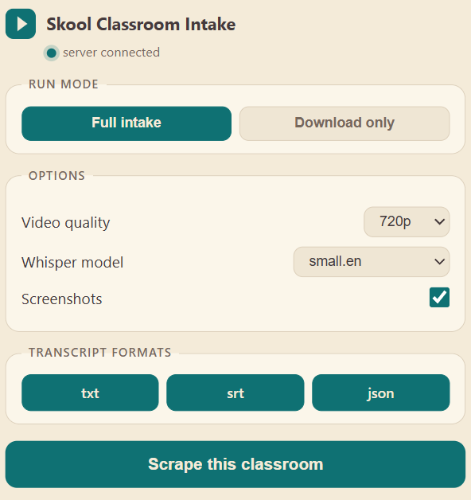
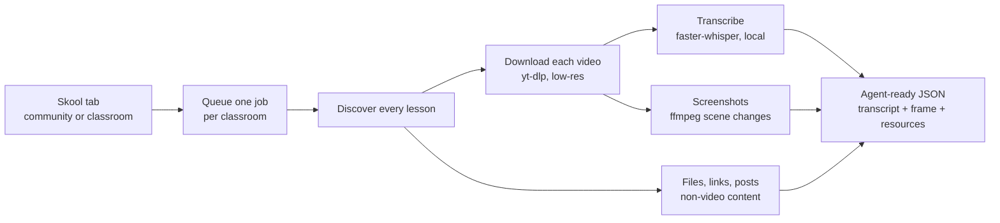
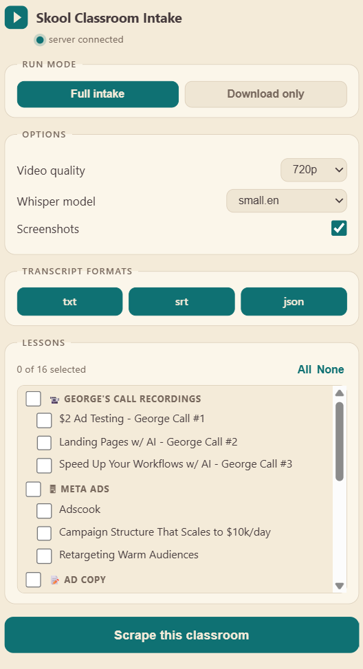

# skoolVidScraper

**Turn an entire Skool community into agent-readable knowledge.** Point it at one
classroom *or a whole community* and it ingests everything: every lesson video is
downloaded, transcribed locally, and screenshotted at each on-screen change, then
fused into a single JSON where each line of transcript carries the exact frame that
was on screen when it was said — **plus the non-video material**: attached PDFs,
external links, written lessons, and lessons that are really a linked discussion post.

Think **NotebookLM-style ingestion, but for Skool courses** and pointed at your AI
agents, RAG pipelines, or note systems.

> [!IMPORTANT]
> **For personal use only.** Use skoolVidScraper only on classrooms you are a
> legitimate, paid-up member of, and only for your own study, note-taking, and
> private AI knowledge bases. **Do not redistribute, re-host, resell, or publicly
> share** downloaded videos, transcripts, or screenshots, and do not use this tool
> for piracy or any other unlawful purpose. Course content belongs to its
> creators. You alone are responsible for complying with Skool's Terms of Service,
> copyright law, and each creator's rights.


<p align="center">
  
  <br>
  <em>One click from the classroom tab: pick your settings and scrape.</em>
</p>

---

## Why

Skool hosts a huge amount of high-signal course content, but it is locked inside a
video player. If you want an AI agent to actually *use* a course, you need both
**what was said** and **what was on screen** (slides, dashboards, code, diagrams),
aligned in time. skoolVidScraper produces exactly that, entirely on your machine:

- **No API keys, no cloud.** Transcription runs locally via Whisper.
- **No passwords, no browser automation.** It authenticates with your own live
  browser session.
- **One click.** A bundled Chrome extension launches the whole pipeline from the
  tab you are already looking at — a single classroom, or the entire community.

## How it works


```mermaid
flowchart LR
    A[Skool tab<br/>community or classroom] --> Q[Queue one job<br/>per classroom]
    Q --> B[Discover every lesson]
    B --> C[Download each video<br/>yt-dlp, low-res]
    B --> G[Files, links, posts<br/>non-video content]
    C --> D[Transcribe<br/>faster-whisper, local]
    C --> E[Screenshots<br/>ffmpeg scene changes]
    D --> F[Agent-ready JSON<br/>transcript + frame + resources]
    E --> F
    G --> F
```

The URL decides the scope: a **community** index (`.../classroom`) queues every
classroom in it; a **single classroom** scrapes just that one. Jobs run one at a
time, so you can line several up and walk away.

One authenticated fetch enumerates each lesson tree. Videos on Wistia, YouTube,
Loom, and **Mux signed-HLS** are all handled. Screenshots use a hybrid strategy: a
frame at every visual change plus a guaranteed frame every N seconds, so nothing is
missed even on talking-head lessons. The **lesson**, not the video, is the unit —
so a lesson with only a PDF, a set of links, or a write-up is captured too.

## Features

- One-click **Chrome extension** launcher (reads the active URL + your live Skool cookies), usable as a popup or a **pinnable, resizable side panel**
- **Scrape a whole community** (every classroom) or just one — decided by the URL you're on
- **Job queue**: line up several classrooms or a whole community and walk away; jobs run one at a time, and one failure never aborts the batch
- **Locked/paid classrooms are skipped cleanly**, and reported, instead of producing empty folders
- **Pick exactly which lessons or sections to scrape** (a checklist in the popup, or `--lessons` / `--section` on the CLI) so big classrooms aren't all-or-nothing
- **Local, offline transcription** with [faster-whisper](https://github.com/SYSTRAN/faster-whisper) (auto-detects an NVIDIA GPU, falls back to CPU)
- **Scene-change + interval screenshots** via ffmpeg, named by timestamp
- **Consolidated JSON** aligning each transcript segment to the on-screen frame
- **Captures the non-video material too**: downloads attached files (PDFs), records external links (Google Docs, Drive, ...), keeps written lessons, and lifts the content out of lessons that are really a **linked discussion post**
- Renders Skool's rich-text lesson bodies to **readable text**, not raw markup
- Drops an **`INGEST.md`** in every folder so a downstream AI agent knows the schema
- Handles **Mux signed-HLS**, Wistia, YouTube, Loom, and more (via yt-dlp)
- **Output nests per community**, so classrooms grabbed on different days stay grouped
- Runs as a **system-tray app**, a **CLI**, or a **local server**

## Quickstart

**Requirements:** Python 3.10+, [ffmpeg](https://ffmpeg.org/) on your PATH
(`winget install Gyan.FFmpeg` on Windows). An NVIDIA GPU is optional (CPU works).

```bash
git clone https://github.com/grandheman/skoolVidScraper
cd skoolVidScraper

# install the CLI (add [tray] for the system-tray app, [gpu] for NVIDIA acceleration)
pip install ".[tray,gpu]"
```

### The one-click way (recommended)

1. Start the helper as a tray app (or `skoolvidscraper serve` for a console):
   ```bash
   skoolvidscraper tray
   ```
2. Load the extension: open `chrome://extensions`, enable **Developer mode**, click
   **Load unpacked**, and select the `extension/` folder.
3. Open a Skool tab and click the extension icon:
   - On a **classroom** (`.../classroom/<id>`): tick the lessons you want (or leave
     them all) and hit **Scrape this classroom**.
   - On the **community index** (`.../classroom`): it shows every classroom and the
     button becomes **Scrape all N classrooms** — one job per classroom, queued.

   Progress, the active job, and the pending queue all show in the panel. You can
   keep queueing more while a job runs.

> [!TIP]
> Prefer it docked? Open Chrome's **side panel** and pick *Skool Classroom Intake*.
> It's resizable and stays pinned while you browse between classrooms, which is
> handy for watching a long queue.

<p align="center">
  
  <br>
  <em>Cherry-pick individual lessons or whole sections before scraping.</em>
</p>

That is it. No cookie exports, no config files. The extension reads your live
Skool session (including the HttpOnly auth cookies) and hands the job to the local
helper.

### The command-line way

```bash
cp config.example.json config.json         # set "classroom_url" (and provide cookies)
skoolvidscraper scrape --transcribe         # whole classroom: download + transcribe + screenshots
skoolvidscraper scrape --lessons 1-5,8      # only some lessons (1-based)
skoolvidscraper scrape --section "Getting Started"   # only a section
```

Re-run intake on an already-downloaded folder anytime:

```bash
skoolvidscraper transcribe --model medium.en
skoolvidscraper transcribe --formats json --no-screenshots
```

> [!NOTE]
> The CLI scrapes one classroom at a time (whole-community queueing is an extension
> feature), and it records attached files' details without downloading them: Skool's
> file endpoint sits behind a WAF that only a real browser clears, so the extension
> resolves those download URLs and hands them to the helper. Links, written lessons,
> and linked-post content are captured in both modes.

## Output

Output nests per community, then per classroom:

```
downloads/<Community>/<Classroom Title>/
  INGEST.md                 # tells a downstream AI agent how to read this folder
  resources.json            # every lesson's non-video content (files, links, text)
  Introduction.mp4
  Introduction.txt          # plain transcript
  Introduction.srt          # subtitles
  Introduction.json         # agent-facing: each segment + the frame on screen
  frames/Introduction/HH-MM-SS.jpg
  resources/Introduction/checklist.pdf     # downloaded attachments
```

The `.json` is the artifact meant for an AI agent:

```json
{
  "source": "Introduction.mp4",
  "language": "en",
  "duration": 547.18,
  "desc": "The lesson's written body, rendered to readable text.",
  "resources": [
    { "type": "file", "title": "Checklist", "file_name": "checklist.pdf", "path": "resources/Introduction/checklist.pdf" },
    { "type": "link", "title": "Slides", "link": "https://docs.google.com/..." }
  ],
  "segments": [
    { "start": 142.2, "end": 147.4, "text": "...", "screenshot": "frames/Introduction/00-02-20.jpg" }
  ],
  "screenshots": [ { "t": 140.85, "file": "frames/Introduction/00-02-20.jpg" } ]
}
```

Lessons with no video (a PDF drop, a link list, or a linked discussion post) don't
get their own `.json` — they're listed in **`resources.json`** alongside everything
else, so nothing in the classroom is lost.

## Configuration

Defaults live in `config.json` (copy from `config.example.json`). The extension's
popup settings override these per run.

| Field | Purpose |
|-------|---------|
| `classroom_url` | The Skool classroom to scrape (CLI mode) |
| `output_directory` | Where downloads and intake land |
| `max_video_height` | Resolution cap (720 keeps slide text readable) |
| `transcription.model` | Whisper model (`base.en`, `small.en`, `medium.en`, ...) |
| `transcription.formats` | Any of `txt`, `srt`, `json` |
| `transcription.scene_threshold` | Screenshot sensitivity (lower = more frames) |
| `transcription.max_interval` | Guarantee a frame every N seconds (0 = pure scene-change) |

## Cookies (command-line mode only)

The Chrome extension supplies cookies automatically. For the CLI, provide them via
`cookies.txt` (Netscape format), `cookies.json` (a Chrome cookie-export extension's
JSON), or a direct Chrome read (browser-cookie3, may fail on Chrome 127+).

## Please use responsibly

Only scrape classrooms you are legitimately a member of and have the right to
access. This tool authenticates as you and is intended for personal study,
note-taking, and building private AI knowledge bases. Respect Skool's Terms of
Service and each creator's rights.

## Acknowledgements

This project began as a fork of
[**kjf305/skool-video-downloader**](https://github.com/kjf305/skool-video-downloader),
the original Skool downloader that made the discovery approach possible. Huge
thanks to [@kjf305](https://github.com/kjf305) for the head start. skoolVidScraper
has since been substantially rewritten into a full intake engine (local
transcription, screenshots, Mux support, and a one-click extension).

Built with [yt-dlp](https://github.com/yt-dlp/yt-dlp),
[faster-whisper](https://github.com/SYSTRAN/faster-whisper), and
[ffmpeg](https://ffmpeg.org/).

## License

[MIT](LICENSE). If this saved you time, a star helps others find it. Contributions welcome.
